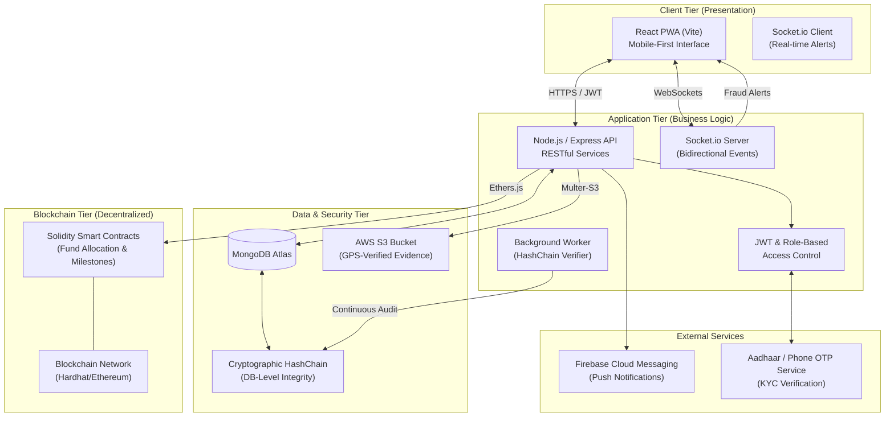

# UrbanHeliX System Architecture 🏙️🔗

UrbanHeliX is a multi-tier platform designed for transparent municipal fund management. It combines traditional web technologies with blockchain-inspired security to ensure data integrity and public accountability.

## 1. High-Level Architecture Diagram

## 2. Component Breakdown

### A. Presentation Layer (Frontend)
- **React.js (Vite)**: Utilizes a "Premium Midnight" theme with vanilla CSS for high-performance and aesthetic consistency.
- **Progressive Web App (PWA)**: Provides a native app experience on mobile devices, including offline access and installability.
- **Socket.io Client**: Listens for real-time "Fraud Alerts" if the system detects database tampering.
- **Role-Based Dashboards**: Tailored interfaces for:
    - **Citizens**: Grievance reporting and fund tracking.
    - **Contractors**: Milestone updates and budget requests.
    - **Engineers**: Verification and site inspections.
    - **Admins**: Project approval and system monitoring.

### B. Application Layer (Backend)
- **Express.js API**: Handles RESTful communication with the client.
- **Socket.io Integration**: Provides real-time event broadcasting (e.g., instant notifications when a fund is approved).
- **Identity & Security Middleware**: 
    - **Aadhaar & Phone Verification**: Mandatory KYC step for all users (Citizens, Engineers, Contractors, Finance Officers) to ensure non-repudiation.
    - **JWT Strategy**: Ensures stateless and secure user sessions.
    - **GPS Metadata Extractor**: Validates that photo evidence was taken at the specified project site coordinates.
- **Integrity Checker**: A background service that runs every 10 seconds to verify the cryptographic chain of database records.

### C. Data & Storage Layer
- **MongoDB**: Stores structured data for users, projects, and wards.
- **HashChain Service**: Implements a sequential cryptographic link between records. Each record contains the hash of the previous record, making unauthorized database edits instantly detectable.
- **AWS S3**: Serves as the persistent object storage for high-resolution site photos and audit documents.

### D. Blockchain Layer
- **Solidity Smart Contracts**: Acts as the "Source of Truth" for critical financial transactions and project state changes.
- **Ethers.js**: Facilitates the interaction between the Node.js backend and the blockchain network, signing transactions and reading contract states.

### E. Integration Services
- **Firebase Admin SDK**: Manages cross-platform push notifications to keep users informed even when the PWA is not active.
- **Audit Logging**: Comprehensive tracking of all administrative actions for transparency.

---

## 3. Key Security Workflows

1. **Identity-Linked Milestones**: Before a contractor submits a milestone or an engineer approves it, the system requires a secondary Aadhaar/Phone OTP verification. This creates a cryptographically signed "Identity Proof" stored alongside the milestone on the blockchain.
2. **Tamper Detection**: If a record in the MongoDB is modified directly (bypassing the API), the `HashChainService` identifies the mismatch and triggers a site-wide `SYSTEM SECURITY ALERT` via Socket.io.
3. **GPS Enforcement**: When a contractor uploads a milestone photo, the backend parses the EXIF data. If the coordinates don't match the project's geo-fence, the upload is rejected.
4. **Immutable Milestones**: Once a milestone is verified by an engineer, its status is recorded on the blockchain, preventing any retrospective changes to the project's progress history.

---

## 4. Development Modules (Phase-wise Roadmap)

To ensure systematic development, the project is divided into five distinct modules, each focusing on a core pillar of the platform.

### Module 1: Foundation & Identity Verification
- **Focus**: User onboarding and security.
- **Key Features**:
    - Multi-role Authentication (Citizen, Contractor, Engineer, Finance).
    - **Aadhaar & Phone OTP integration** for identity verification.
    - JWT-based session management and Role-Based Access Control (RBAC).
    - Basic user profile and department management.

### Module 2: Project Lifecycle & Fund Allocation
- **Focus**: Workflow management.
- **Key Features**:
    - Project Proposal and Approval workflow.
    - Fund allocation and budget tracking across wards/departments.
    - Ward and Area-wise data visualization using **Recharts**.
    - RESTful API endpoints for project CRUD operations.

### Module 3: Security & Real-Time Integrity (HashChain)
- **Focus**: Data protection and alerting.
- **Key Features**:
    - Implementation of the **Cryptographic HashChain** in MongoDB.
    - Background **Integrity Checker** for continuous database auditing.
    - **Socket.io** integration for real-time fraud alerts and system notifications.
    - Emergency tamper simulation for demonstration purposes.

### Module 4: Evidence Tracking & Public Grievance
- **Focus**: Accountability and transparency.
- **Key Features**:
    - **GPS-Verified** photo evidence upload for project milestones.
    - **AWS S3 Integration** for secure media storage.
    - Citizen Grievance Portal for reporting infrastructure issues.
    - Milestone verification workflow for Engineers.

### Module 5: Blockchain Integration & PWA Optimization
- **Focus**: Immutability and Accessibility.
- **Key Features**:
    - **Solidity Smart Contracts** for immutable audit trails of funds and milestones.
    - **Ethers.js** integration for backend-to-blockchain communication.
    - **Progressive Web App (PWA)** conversion for offline access and mobile installation.
    - Final UI polish and premium midnight theme optimization.
